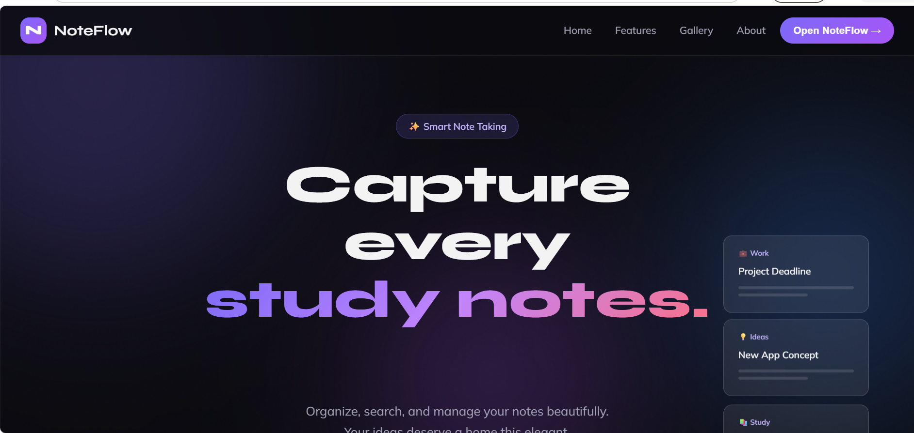
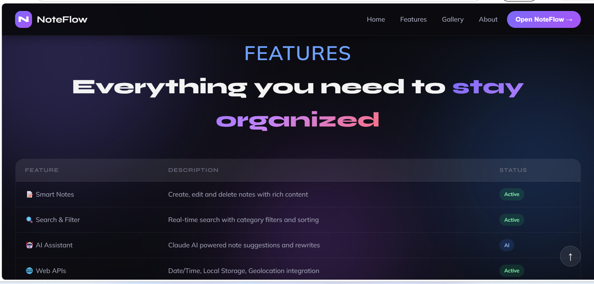
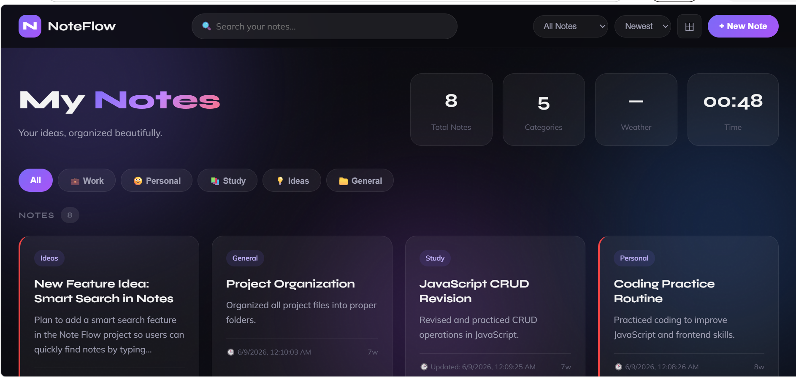
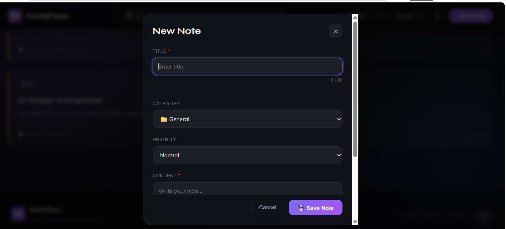

# 📝 NoteFlow App

NoteFlow is a simple web-based Notes application that allows users to create, view, edit, and manage notes easily in the browser.

---

## 🚀 Features

- 🏠 Home page  
- ⭐ Features section  
- 📝 Notes management  
- ✏️ Edit notes functionality  
- 🗑️ Delete notes support  

---

## 🛠️ Tech Stack

- HTML5  
- CSS3  
- JavaScript (Vanilla JS)

---

## 📸 Screenshots

### 🏠 Home


### ⭐ Features


### 📝 Notes


### ✏️ Edit Notes


---

## ▶️ How to Run This Project

1. Clone repository:
```bash
git clone https://github.com/Nehashehzadi37/NoteFlow-App
